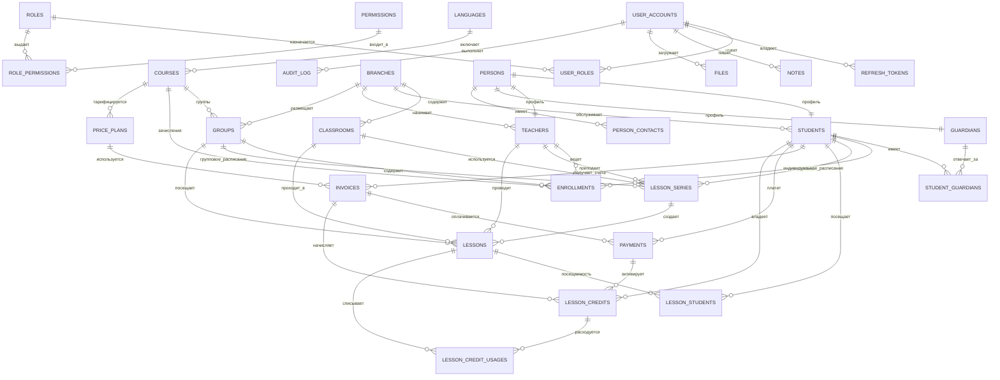
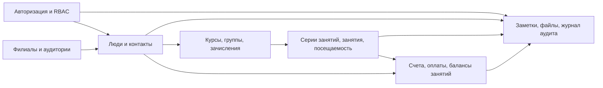

# Схема базы данных для CRM школы иностранных языков

Целевая СУБД: PostgreSQL 16+.

Схема намеренно разделена на устойчивые домены: идентификация, люди, учебный блок, расписание, финансы и аудит. Это позволяет сохранить первый релиз компактным, но оставить место для филиалов, лидов, групп, расчета зарплат, учебных программ, задач, уведомлений и аналитики.

## Принципы проектирования

- Использовать `uuid` как первичные ключи для публичных идентификаторов и безопасных распределенных вставок.
- Держать авторизацию отдельно от CRM-профилей. Преподаватель, менеджер или администратор является `user_account`, а ученик или опекун может существовать без доступа к системе.
- Использовать явные таблицы связей для отношений many-to-many: у учеников со временем могут быть несколько опекунов, групп, преподавателей и зачислений на курсы.
- Хранить деньги в минимальных целочисленных единицах (`amount_cents`) вместе с `currency`, без чисел с плавающей точкой.
- Избегать физического удаления бизнес-записей. Для жизненного цикла использовать статусы и `archived_at`.
- С первого дня добавить индексы под списки CRM, расписание, долги по оплатам и аудит.
- Использовать JSONB только как точку расширения, а не для основных полей, по которым нужен поиск.

## Расширения

```sql
create extension if not exists pgcrypto;
create extension if not exists citext;
create extension if not exists btree_gist;
```

## Общие enum-типы

```sql
create type user_status as enum ('active', 'invited', 'blocked', 'archived');
create type person_status as enum ('lead', 'active', 'paused', 'archived');
create type lesson_status as enum ('planned', 'completed', 'cancelled', 'missed');
create type lesson_format as enum ('online', 'offline', 'hybrid');
create type attendance_status as enum ('planned', 'attended', 'missed', 'cancelled');
create type payment_status as enum ('pending', 'paid', 'partially_refunded', 'refunded', 'cancelled', 'failed');
create type invoice_status as enum ('draft', 'issued', 'partially_paid', 'paid', 'void', 'overdue');
create type contact_type as enum ('phone', 'email', 'telegram', 'whatsapp', 'vk', 'other');
```

## Идентификация и контроль доступа

```sql
create table user_accounts (
  id uuid primary key default gen_random_uuid(),
  email citext not null unique,
  password_hash text not null,
  status user_status not null default 'invited',
  last_login_at timestamptz,
  created_at timestamptz not null default now(),
  updated_at timestamptz not null default now()
);

create table roles (
  id uuid primary key default gen_random_uuid(),
  code text not null unique,
  name text not null,
  description text,
  created_at timestamptz not null default now()
);

create table permissions (
  id uuid primary key default gen_random_uuid(),
  code text not null unique,
  description text
);

create table role_permissions (
  role_id uuid not null references roles(id) on delete cascade,
  permission_id uuid not null references permissions(id) on delete cascade,
  primary key (role_id, permission_id)
);

create table user_roles (
  user_id uuid not null references user_accounts(id) on delete cascade,
  role_id uuid not null references roles(id) on delete restrict,
  primary key (user_id, role_id)
);

create table refresh_tokens (
  id uuid primary key default gen_random_uuid(),
  user_id uuid not null references user_accounts(id) on delete cascade,
  token_hash text not null unique,
  user_agent text,
  ip inet,
  expires_at timestamptz not null,
  revoked_at timestamptz,
  created_at timestamptz not null default now()
);

create index idx_refresh_tokens_user_active
  on refresh_tokens (user_id, expires_at)
  where revoked_at is null;
```

Рекомендуемые начальные роли:

- `owner`
- `admin`
- `manager`
- `teacher`
- `accountant`

## Структура организации

```sql
create table branches (
  id uuid primary key default gen_random_uuid(),
  name text not null,
  timezone text not null default 'Asia/Yekaterinburg',
  address text,
  phone text,
  is_active boolean not null default true,
  created_at timestamptz not null default now(),
  updated_at timestamptz not null default now()
);

create table classrooms (
  id uuid primary key default gen_random_uuid(),
  branch_id uuid not null references branches(id) on delete restrict,
  name text not null,
  capacity integer check (capacity is null or capacity > 0),
  is_active boolean not null default true,
  created_at timestamptz not null default now(),
  unique (branch_id, name)
);
```

Даже если в первой версии будет один филиал, раннее добавление `branch_id` избавит от болезненной миграции, когда появятся офлайн-занятия или франшизы.

## Люди и контакты

```sql
create table persons (
  id uuid primary key default gen_random_uuid(),
  first_name text not null,
  last_name text not null,
  middle_name text,
  birth_date date,
  status person_status not null default 'active',
  created_at timestamptz not null default now(),
  updated_at timestamptz not null default now(),
  archived_at timestamptz
);

create index idx_persons_name
  on persons (last_name, first_name, middle_name);

create table person_contacts (
  id uuid primary key default gen_random_uuid(),
  person_id uuid not null references persons(id) on delete cascade,
  type contact_type not null,
  value text not null,
  is_primary boolean not null default false,
  is_verified boolean not null default false,
  created_at timestamptz not null default now()
);

create index idx_person_contacts_lookup
  on person_contacts (type, value);

create table students (
  id uuid primary key default gen_random_uuid(),
  person_id uuid not null unique references persons(id) on delete restrict,
  branch_id uuid references branches(id) on delete restrict,
  level_code text,
  goal text,
  source text,
  assigned_manager_id uuid references user_accounts(id) on delete set null,
  started_at date,
  created_at timestamptz not null default now(),
  updated_at timestamptz not null default now()
);

create index idx_students_branch
  on students (branch_id);

create index idx_students_manager
  on students (assigned_manager_id);

create table teachers (
  id uuid primary key default gen_random_uuid(),
  person_id uuid not null unique references persons(id) on delete restrict,
  user_id uuid unique references user_accounts(id) on delete set null,
  branch_id uuid references branches(id) on delete restrict,
  hourly_rate_cents integer check (hourly_rate_cents is null or hourly_rate_cents >= 0),
  currency char(3) not null default 'RUB',
  bio text,
  is_active boolean not null default true,
  created_at timestamptz not null default now(),
  updated_at timestamptz not null default now()
);

create index idx_teachers_branch_active
  on teachers (branch_id, is_active);

create table guardians (
  id uuid primary key default gen_random_uuid(),
  person_id uuid not null unique references persons(id) on delete restrict,
  created_at timestamptz not null default now()
);

create table student_guardians (
  student_id uuid not null references students(id) on delete cascade,
  guardian_id uuid not null references guardians(id) on delete cascade,
  relation text not null,
  is_primary boolean not null default false,
  can_receive_finance_info boolean not null default true,
  can_receive_progress_info boolean not null default true,
  primary key (student_id, guardian_id)
);

create index idx_student_guardians_guardian
  on student_guardians (guardian_id);
```

## Учебный каталог

```sql
create table languages (
  id uuid primary key default gen_random_uuid(),
  code text not null unique,
  name text not null
);

create table courses (
  id uuid primary key default gen_random_uuid(),
  language_id uuid not null references languages(id) on delete restrict,
  name text not null,
  level_code text,
  description text,
  is_active boolean not null default true,
  created_at timestamptz not null default now(),
  updated_at timestamptz not null default now()
);

create index idx_courses_language_active
  on courses (language_id, is_active);

create table groups (
  id uuid primary key default gen_random_uuid(),
  branch_id uuid references branches(id) on delete restrict,
  course_id uuid references courses(id) on delete restrict,
  name text not null,
  max_students integer check (max_students is null or max_students > 0),
  status person_status not null default 'active',
  created_at timestamptz not null default now(),
  updated_at timestamptz not null default now()
);

create index idx_groups_branch_status
  on groups (branch_id, status);

create table enrollments (
  id uuid primary key default gen_random_uuid(),
  student_id uuid not null references students(id) on delete restrict,
  course_id uuid references courses(id) on delete restrict,
  group_id uuid references groups(id) on delete set null,
  primary_teacher_id uuid references teachers(id) on delete set null,
  status person_status not null default 'active',
  started_at date not null default current_date,
  ended_at date,
  created_at timestamptz not null default now(),
  updated_at timestamptz not null default now(),
  check (ended_at is null or ended_at >= started_at)
);

create index idx_enrollments_student_status
  on enrollments (student_id, status);

create index idx_enrollments_teacher_status
  on enrollments (primary_teacher_id, status);

create index idx_enrollments_group_status
  on enrollments (group_id, status);
```

## Расписание и занятия

```sql
create table lesson_series (
  id uuid primary key default gen_random_uuid(),
  group_id uuid references groups(id) on delete cascade,
  student_id uuid references students(id) on delete cascade,
  teacher_id uuid not null references teachers(id) on delete restrict,
  branch_id uuid references branches(id) on delete restrict,
  classroom_id uuid references classrooms(id) on delete set null,
  format lesson_format not null default 'online',
  title text not null,
  rrule text,
  starts_on date,
  ends_on date,
  is_active boolean not null default true,
  created_at timestamptz not null default now(),
  updated_at timestamptz not null default now(),
  check (
    (group_id is not null and student_id is null)
    or (group_id is null and student_id is not null)
  )
);

create index idx_lesson_series_teacher_active
  on lesson_series (teacher_id, is_active);

create table lessons (
  id uuid primary key default gen_random_uuid(),
  series_id uuid references lesson_series(id) on delete set null,
  group_id uuid references groups(id) on delete set null,
  teacher_id uuid not null references teachers(id) on delete restrict,
  branch_id uuid references branches(id) on delete restrict,
  classroom_id uuid references classrooms(id) on delete set null,
  starts_at timestamptz not null,
  ends_at timestamptz not null,
  format lesson_format not null default 'online',
  status lesson_status not null default 'planned',
  topic text,
  homework text,
  teacher_comment text,
  cancellation_reason text,
  created_at timestamptz not null default now(),
  updated_at timestamptz not null default now(),
  check (ends_at > starts_at)
);

create index idx_lessons_schedule
  on lessons (starts_at, ends_at);

create index idx_lessons_teacher_schedule
  on lessons (teacher_id, starts_at);

create index idx_lessons_group_schedule
  on lessons (group_id, starts_at);

create index idx_lessons_branch_schedule
  on lessons (branch_id, starts_at);

create table lesson_students (
  lesson_id uuid not null references lessons(id) on delete cascade,
  student_id uuid not null references students(id) on delete restrict,
  attendance attendance_status not null default 'planned',
  result text,
  comment text,
  created_at timestamptz not null default now(),
  updated_at timestamptz not null default now(),
  primary key (lesson_id, student_id)
);

create index idx_lesson_students_student
  on lesson_students (student_id, lesson_id);

create index idx_lesson_students_attendance
  on lesson_students (attendance);
```

### Опциональная защита от пересечений

Включать после стабилизации правил расписания. Ограничение не даст поставить два запланированных занятия одному преподавателю на пересекающееся время.

```sql
alter table lessons
  add constraint lessons_teacher_no_overlap
  exclude using gist (
    teacher_id with =,
    tstzrange(starts_at, ends_at, '[)') with &&
  )
  where (status = 'planned');

alter table lessons
  add constraint lessons_classroom_no_overlap
  exclude using gist (
    classroom_id with =,
    tstzrange(starts_at, ends_at, '[)') with &&
  )
  where (status = 'planned' and classroom_id is not null);
```

## Финансы

```sql
create table price_plans (
  id uuid primary key default gen_random_uuid(),
  name text not null,
  course_id uuid references courses(id) on delete restrict,
  lessons_count integer check (lessons_count is null or lessons_count > 0),
  amount_cents integer not null check (amount_cents >= 0),
  currency char(3) not null default 'RUB',
  valid_from date not null default current_date,
  valid_to date,
  is_active boolean not null default true,
  created_at timestamptz not null default now(),
  check (valid_to is null or valid_to >= valid_from)
);

create index idx_price_plans_active
  on price_plans (is_active, course_id);

create table invoices (
  id uuid primary key default gen_random_uuid(),
  student_id uuid not null references students(id) on delete restrict,
  price_plan_id uuid references price_plans(id) on delete set null,
  status invoice_status not null default 'draft',
  total_amount_cents integer not null check (total_amount_cents >= 0),
  paid_amount_cents integer not null default 0 check (paid_amount_cents >= 0),
  currency char(3) not null default 'RUB',
  issued_at timestamptz,
  due_at timestamptz,
  created_by uuid references user_accounts(id) on delete set null,
  created_at timestamptz not null default now(),
  updated_at timestamptz not null default now(),
  check (paid_amount_cents <= total_amount_cents)
);

create index idx_invoices_student_status
  on invoices (student_id, status);

create index idx_invoices_due_unpaid
  on invoices (due_at)
  where status in ('issued', 'partially_paid', 'overdue');

create table payments (
  id uuid primary key default gen_random_uuid(),
  student_id uuid not null references students(id) on delete restrict,
  invoice_id uuid references invoices(id) on delete set null,
  status payment_status not null default 'pending',
  amount_cents integer not null check (amount_cents > 0),
  currency char(3) not null default 'RUB',
  method text,
  external_payment_id text,
  paid_at timestamptz,
  received_by uuid references user_accounts(id) on delete set null,
  comment text,
  created_at timestamptz not null default now(),
  updated_at timestamptz not null default now()
);

create unique index uq_payments_external_payment_id
  on payments (external_payment_id)
  where external_payment_id is not null;

create index idx_payments_student_created
  on payments (student_id, created_at desc);

create index idx_payments_paid_at
  on payments (paid_at)
  where status = 'paid';

create table lesson_credits (
  id uuid primary key default gen_random_uuid(),
  student_id uuid not null references students(id) on delete restrict,
  invoice_id uuid references invoices(id) on delete set null,
  payment_id uuid references payments(id) on delete set null,
  initial_lessons integer not null check (initial_lessons > 0),
  remaining_lessons integer not null check (remaining_lessons >= 0),
  expires_at date,
  created_at timestamptz not null default now(),
  updated_at timestamptz not null default now(),
  check (remaining_lessons <= initial_lessons)
);

create index idx_lesson_credits_student_active
  on lesson_credits (student_id, expires_at)
  where remaining_lessons > 0;

create table lesson_credit_usages (
  id uuid primary key default gen_random_uuid(),
  lesson_credit_id uuid not null references lesson_credits(id) on delete restrict,
  lesson_id uuid not null references lessons(id) on delete restrict,
  student_id uuid not null references students(id) on delete restrict,
  used_lessons integer not null default 1 check (used_lessons > 0),
  created_at timestamptz not null default now(),
  unique (lesson_id, student_id)
);

create index idx_lesson_credit_usages_credit
  on lesson_credit_usages (lesson_credit_id);
```

`lesson_credits` поддерживает текущий UI вида "баланс: 4 занятия". Позже эту модель можно заменить или расширить транзакциями внутреннего кошелька, не меняя занятия и оплаты.

## Заметки, файлы и аудит

```sql
create table notes (
  id uuid primary key default gen_random_uuid(),
  entity_type text not null,
  entity_id uuid not null,
  author_id uuid references user_accounts(id) on delete set null,
  body text not null,
  is_pinned boolean not null default false,
  created_at timestamptz not null default now(),
  updated_at timestamptz not null default now()
);

create index idx_notes_entity_created
  on notes (entity_type, entity_id, created_at desc);

create table files (
  id uuid primary key default gen_random_uuid(),
  entity_type text not null,
  entity_id uuid not null,
  uploaded_by uuid references user_accounts(id) on delete set null,
  storage_key text not null unique,
  filename text not null,
  mime_type text not null,
  size_bytes bigint not null check (size_bytes > 0),
  created_at timestamptz not null default now()
);

create index idx_files_entity
  on files (entity_type, entity_id);

create table audit_log (
  id bigserial primary key,
  actor_user_id uuid references user_accounts(id) on delete set null,
  action text not null,
  entity_type text not null,
  entity_id uuid,
  before_data jsonb,
  after_data jsonb,
  ip inet,
  user_agent text,
  created_at timestamptz not null default now()
);

create index idx_audit_log_entity
  on audit_log (entity_type, entity_id, created_at desc);

create index idx_audit_log_actor
  on audit_log (actor_user_id, created_at desc);
```

При большом объеме записей `audit_log` позже можно партиционировать по месяцам. Таблица намеренно изолирована от транзакционных бизнес-таблиц.

## Операционные узкие места

### Запросы к расписанию

Большинство экранов CRM будет фильтровать занятия по диапазону дат, преподавателю, филиалу или группе. Эти индексы нужно сохранить:

- `idx_lessons_schedule`
- `idx_lessons_teacher_schedule`
- `idx_lessons_branch_schedule`
- `idx_lesson_students_student`

Для тяжелых календарей стоит добавить модель чтения или материализованное представление по дням или неделям.

### Расчет задолженности и баланса

Не стоит считать задолженность сканированием всех оплат на каждый запрос дашборда. На старте достаточно индексированных счетов и балансов занятий. Позже можно добавить `student_finance_summary` как материализованное представление или таблицу-проекцию, обновляемую событиями оплат и занятий.

### Поиск

Поиск по имени и контактам начинается с B-tree индексов. Когда данных станет больше, стоит добавить `pg_trgm` и индексы для нечеткого поиска:

```sql
create extension if not exists pg_trgm;
create index idx_persons_full_name_trgm
  on persons using gin ((last_name || ' ' || first_name || ' ' || coalesce(middle_name, '')) gin_trgm_ops);
```

### Отчетность

Отчетность не должна собирать каждый запрос дашборда через `join` по горячим OLTP-таблицам. Хорошие кандидаты для будущих проекций:

- `student_finance_summary`
- `teacher_workload_daily`
- `branch_revenue_daily`
- `attendance_summary_monthly`

### Мультитенантность

Если продукт может обслуживать несколько школ, нужно добавить `tenant_id` во все бизнес-таблицы до запуска. Добавлять мультитенантность после выхода в production дорого. Для CRM одной частной школы достаточно `branches`.

## Рекомендуемый порядок первых миграций

1. Расширения и enum-типы.
2. Идентификация и роли.
3. Филиалы и аудитории.
4. Персоны, контакты, ученики, преподаватели, опекуны.
5. Языки, курсы, группы, зачисления.
6. Серии занятий, занятия, посещаемость.
7. Тарифы, счета, оплаты, балансы занятий.
8. Заметки, файлы, журнал аудита.

## Соответствие backend-модулям

- `AuthModule`: `user_accounts`, `roles`, `permissions`, `refresh_tokens`
- `PeopleModule`: `persons`, `person_contacts`
- `StudentsModule`: `students`, `guardians`, `student_guardians`, `notes`
- `TeachersModule`: `teachers`
- `AcademicModule`: `languages`, `courses`, `groups`, `enrollments`
- `ScheduleModule`: `lesson_series`, `lessons`, `lesson_students`
- `FinanceModule`: `price_plans`, `invoices`, `payments`, `lesson_credits`, `lesson_credit_usages`
- `AuditModule`: `audit_log`

## Высокоуровневая ER-диаграмма



## Упрощенная схема модулей


